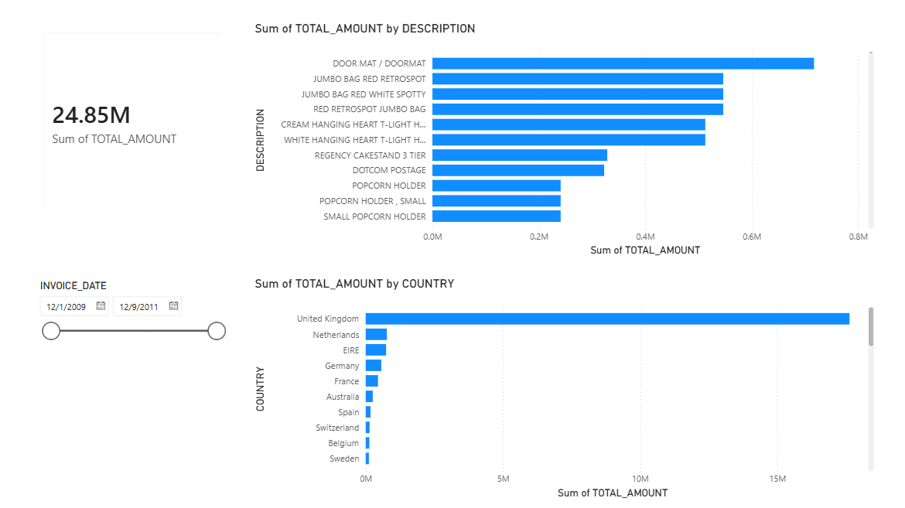
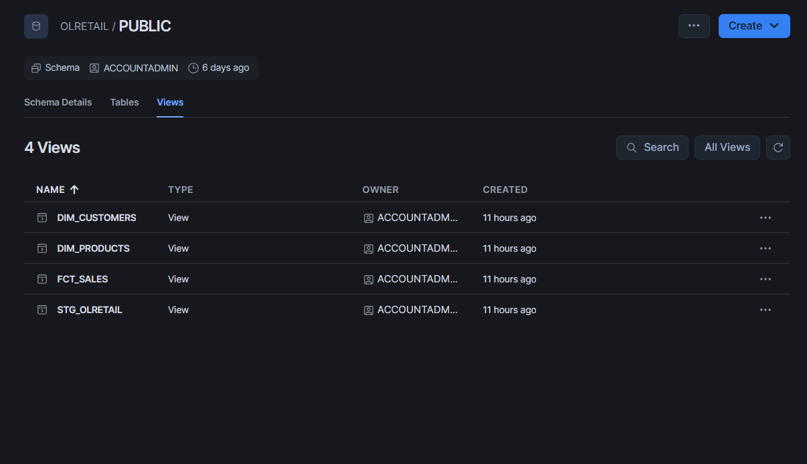
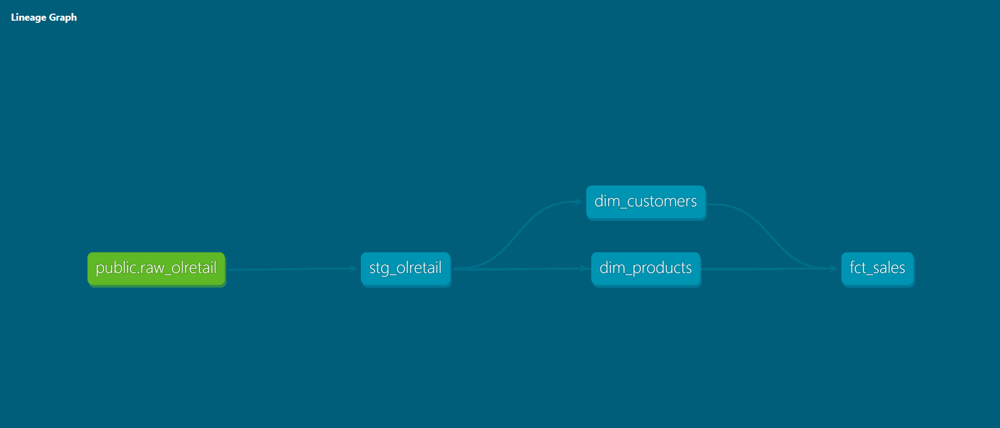

# Online Retail Analytics & Data Warehouse

## Overview
An end-to-end data engineering and analytics project built using Snowflake, dbt, and Power BI to analyze online retail transactions.

## Project Architecture & Lineage
The pipeline follows a modular transformation approach:
1. **Raw Source (`RAW_OLRETAIL`):** The landing table loaded directly into Snowflake.
2. **Staging Layer (`stg_olretail`):** Cleans raw data, standardizes column names to `snake_case`, casts proper data types, and filters out null invoices.
3. **Dimension Layer (`dim_customers`):** Aggregates unique customer profiles and locations.
4. **Fact Layer (`fct_sales`):** Houses transactional line items, calculates total amounts (`quantity * unit_price`), generates surrogate keys via `dbt_utils`, and links back to customer dimensions.

## Data Quality Decisions & Findings
**Dataset Scale:** Explored the raw transaction table (`RAW_OLRETAIL`), uncovering a large transaction volume with dates spanning across the operating period.

* **Customer ID Nulls:** 
Identified a significant number of rows where `CustomerID` is null (representing guest checkouts or unauthenticated web traffic). 
**Decision:** Kept as `NULL` in staging and dimension layers to preserve transaction history without fabricating user profiles.

* **Cancellations & Returns:** 
Found nearly 19,500 rows with invoices starting with "C". These rows consistently display a negative quantity pattern (ranging down to -80,995). 
**Decision:** Maintained as negative values in the fact layer to accurately reflect returned or cancelled stock quantities.

## Directory Structure
```text
olretail_analytics/
├── models/
│   ├── dims/
│   │   ├── dim_customers.sql
│   │   └── fct_sales.sql
│   ├── staging/
│   │   └── stg_olretail.sql
│   └── schema.yml
├── analyses/
├── macros/
├── snapshots/
├── tests/
├── dbt_project.yml
├── packages.yml
└── README.md

Prerequisites

dbt-snowflake installed locally.


A connected Snowflake data warehouse account.


Installation & Execution

1. Clone the repository or navigate to the project directory:

cd olretail_analytics

2. Install project dependencies (such as dbt_utils):

dbt deps

3.Test your Snowflake connection:

dbt debug

4. Run the data models:

dbt run


Downstream Integration

The final models (DIM_CUSTOMERS and FCT_SALES) are optimized for Business Intelligence tools like Power BI or Tableau for reporting on sales trends, revenue, and customer behavior.


## Dashboard Preview


## Data Warehouse Schema


## Snowflake Lineage Graph
